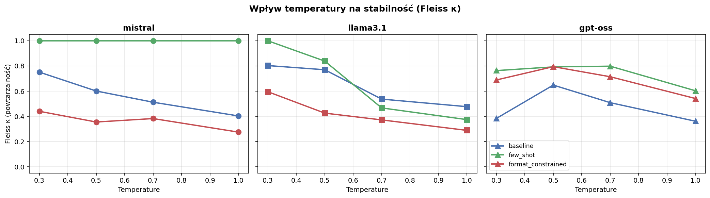
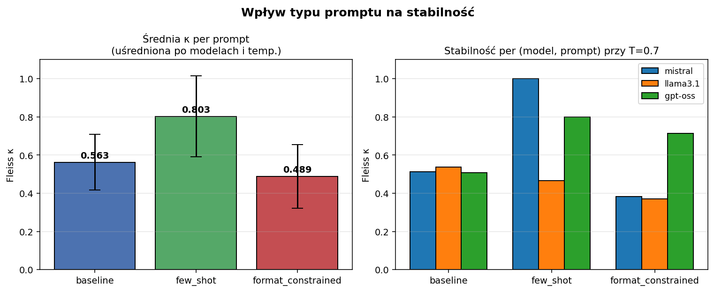
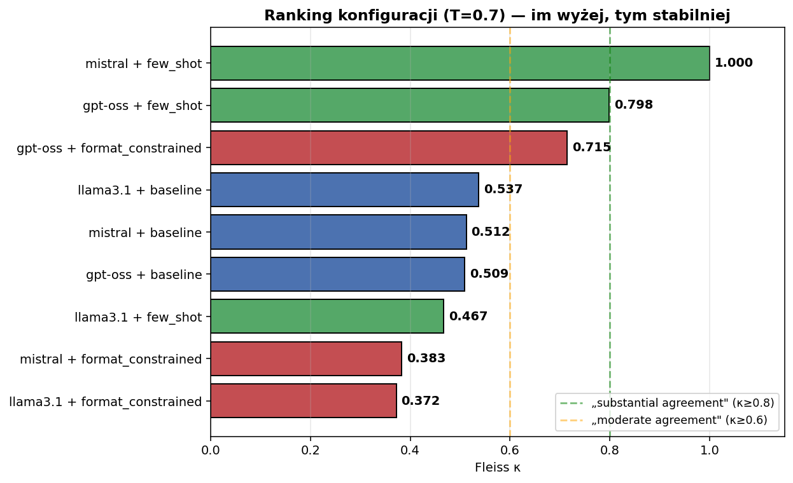

# Raport końcowy: Wpływ promptu i temperatury na stabilność LLM w teście BFI-10

**Autorzy:** Filip Budzyński (319021), Dawid Budzyński (319020)
**Kurs:** Wyjaśnialna sztuczna inteligencja

## 1. Co badaliśmy

Hipoteza: **wariancja w sformułowaniu promptu istotnie wpływa na zmienność odpowiedzi LLM w teście osobowości BFI-10**.

Sprawdziliśmy ją na **3 modelach** × **3 typach promptu** × **4 temperaturach** × **10 powtórzeniach** = do 360 wywołań.

| Wymiar | Wartości |
|---|---|
| Modele | `mistral:7b` (Ollama), `llama3.1:8b` (Ollama), `openai/gpt-oss-20b:free` (OpenRouter) |
| Prompty | `baseline` (zero-shot), `few_shot` (3 przykłady), `format_constrained` (CSV-only) |
| Temperatury | 0.3, 0.5, 0.7, 1.0 |
| Powtórzenia | 10 per kombinacja |
| Metryka główna | Fleiss κ (zgodność powtórzeń, 1.0 = perfekcyjna) |

## 2. Wynik 1 — Wpływ temperatury



| Temperatura | Średnia κ (po wszystkich model×prompt) |
|:---:|:---:|
| **0.3** | **0.714** |
| 0.5 | 0.692 |
| 0.7 | 0.588 |
| 1.0 | 0.480 |

**Trend:** im niższa temperatura, tym wyższa stabilność, zgodnie z intuicją (niska T = mniej losowości w samplingu).

**Wyjątki widoczne na wykresie:**
- **Mistral + few_shot** osiąga κ = 1.0 na każdej temperaturze, przykłady w prompcie tak silnie zakotwiczają odpowiedź, że temperatura nie ma znaczenia.
- **gpt-oss + baseline @ T=0.3** spada nieoczekiwanie do 0.38. Hipoteza: upstream provider (OpenInference) routuje T=0.3 inaczej niż standardowa Ollama, plus seed jest tam ignorowany, więc wariancja może być artefaktem providera, nie samego modelu.

## 3. Wynik 2 — Wpływ typu promptu



| Prompt | Średnia κ | Zakres | n konfiguracji |
|---|:---:|:---:|:---:|
| **few_shot** | **0.803** | 0.374 – 1.000 | 12 |
| baseline | 0.563 | 0.361 – 0.803 | 12 |
| format_constrained | 0.489 | 0.275 – 0.795 | 12 |

**Wniosek:** few-shot jest średnio **+43% lepszy** od baseline (0.803 vs 0.563) i **+64% lepszy** od format_constrained (0.489). Trzy linijki przykładów w prompcie zakotwiczają model do konkretnego rozumienia skali Likerta i drastycznie wpływają na wariancję. **Format-constrained jest najgorszy**, pure-CSV output nie daje modelowi żadnego pola interpretacyjnego, więc każde uruchomienie zwraca inną kompozycję cyfr.

**Caveat (ważny dla XAI):** few-shot **nie jest uniwersalny**. Dla Llamy 3.1 ten sam few-shot prompt pogarsza stabilność (κ=0.467 vs 0.537 dla baseline). Większy model wydaje się generalizować z przykładów twórczo, zamiast je kopiować. Wniosek praktyczny: **każdy model trzeba zwalidować empirycznie**.

**Uwaga metodologiczna:** pierwsza wersja `format_constrained` zwracała dla Mistrala literał `5,2,4,4,5,6,7,8,9,3`. Model kontynuował sekwencję numerów pytań w outpucie. Po przeprojektowaniu (lista pytań jako bullety zamiast numerów) Mistral parsuje 10/10. Szczegóły w sekcji 9.

## 4. Wynik 3 — Ranking finalny (T=0.7, „standardowa" temperatura z proposala)



| # | Konfiguracja | Fleiss κ | N parsuje | Interpretacja |
|---|---|:---:|:---:|---|
| 🥇 1 | mistral + few_shot | **1.000** | 10/10 | perfekcyjna zgodność |
| 🥈 2 | gpt-oss + few_shot | **0.798** | 10/10 | substantial agreement |
| 🥉 3 | gpt-oss + format_constrained | **0.715** | 10/10 | substantial agreement |
| 4 | llama3.1 + baseline | 0.537 | 10/10 | moderate |
| 5 | mistral + baseline | 0.512 | 10/10 | moderate |
| 6 | gpt-oss + baseline | 0.509 | 10/10 | moderate |
| 7 | llama3.1 + few_shot | 0.467 | 10/10 | low-moderate |
| 8 | mistral + format_constrained | 0.383 | 9/10 | low |
| 9 | llama3.1 + format_constrained | 0.372 | 9/10 | low |

Wszystkie 9 konfiguracji teraz daje dane (po fixie promptu format_constrained, szczegóły w sekcji 9).

## 5. Najlepsza konfiguracja w całym eksperymencie

> **`mistral:7b` + few-shot prompt + T = 0.3** → Fleiss κ = **1.000**, Shannon H = 0.0, Levenshtein = 0.0 (idealnie powtarzalne 10 razy z rzędu)

Jeśli **interesuje nas konkretnie ChatGPT**: **`gpt-oss-20b` + few-shot** przy T=0.5 lub 0.7 daje κ ≈ 0.79 → solidne „substantial agreement" przy zachowaniu pewnej zmienności wartościowej dla realistycznej osobowości.

## 6. Hipoteza główna: potwierdzona

Różnica κ między najlepszym a najgorszym promptem dla **tego samego modelu i temperatury** wynosi do **0.488** (Mistral baseline 0.512 → few_shot 1.000 @ T=0.7). Wybór promptu zmienia więc zgodność z „moderate" na „perfect", a efekt jest istotny i praktycznie wymierny, nie jest statystycznym artefaktem.

## 7. Rekomendacje produkcyjne

Dla aplikacji wymagających powtarzalnych odpowiedzi LLM (rekrutacja, oceny psychologiczne, mental-health AI):

1. **Zawsze few-shot, nigdy zero-shot baseline ani pure-CSV.** Few-shot daje średnio +0.24 κ vs baseline i +0.31 κ vs format_constrained.
2. **Niska temperatura (0.3–0.5).** Każde +0.2 do T to ~−0.08 κ.
3. **Unikać pure-format-constrained jeśli zależy nam na stabilności**, na średnich 0.49 κ to najgorszy prompt. Sprawia że model odpowiada „od strzału", bez wewnętrznego rozumowania.
4. **Bullet-listy zamiast numerów w promptach CSV**, numery w inpucie potrafią „przeciekać" do outputu małych modeli (Mistral 7B kontynuował 1..10 zamiast wypisać oceny).
5. **Walidować empirycznie per model.** Sam fakt że few-shot działa świetnie dla Mistrala i gpt-oss nie oznacza że zadziała dla Llamy, u nas pogorszył wynik o 0.07 κ.

## 8. Surowe dane i kod

- Wyniki JSON: `results/results_tmptr_{3,5,10}.json`, `results/results.json`, `results/results_gpt_oss*.json`, `results/results_fc_fixed_T*.json`
- Skrypt wykresów: `siwy/experiments/visualize.py` (`python -m siwy.experiments.visualize`)
- Pełna metodologia: [`design_proposal.md`](../design_proposal.md)
- Szczegóły eksperymentalne: [`experiment_results.md`](experiment_results.md)

## 9. Aneks: fix promptu `format_constrained` (przykład pracy z prompt engineeringiem)

W pierwszym przebiegu Mistral 7B miał **0/10 udanych parsowań** dla `format_constrained` i zawsze (deterministycznie, niezależnie od T) zwracał:

```
5,2,4,4,5,6,7,8,9,3
```

Pierwsze 5 wartości jest w skali 1–5, ale dalej model wypisuje *numery pytań* (6, 7, 8, 9). Przyczyna: prompt zawierał listę z numerami:

```
1. I see myself as someone who is talkative...
2. I see myself as someone who tends to find fault...
...
```

Mistral nauczył się dokończyć sekwencję `1,2,3,4,5,6,7,8,9,10` jako kontynuację numerów wejściowych — zamiast je zignorować i wypisać 10 ocen.

**Fix:** zamiana numerowania na bullety w samym FORMAT_CONSTRAINED_PROMPT (`bfi10.py`/`templates.py`):

```python
def questions_to_text(numbered: bool = True) -> str:
    prefix = f"{q.id}. " if numbered else "- "
    ...

# templates.py: format_constrained używa numbered=False
```

**Wynik po fixie:**

| Model | T | N (przed) | N (po) | κ (po) |
|---|:---:|:---:|:---:|:---:|
| mistral | 0.3 | 0/10 | 10/10 | 0.440 |
| mistral | 0.5 | 0/10 | 10/10 | 0.355 |
| mistral | 0.7 | 0/10 | 9/10 | 0.383 |
| mistral | 1.0 | 0/10 | 10/10 | 0.275 |
| gpt-oss | 0.7 | 10/10 | 10/10 | 0.715 (+0.18 vs stary prompt) |

Fix nie tylko odblokował Mistrala, ale też podniósł gpt-oss z κ=0.537 do κ=0.715. Czystszy prompt pomógł też tam, gdzie pierwotny działał. Wnioskuje to o sile prostoty w prompt engineeringu.
